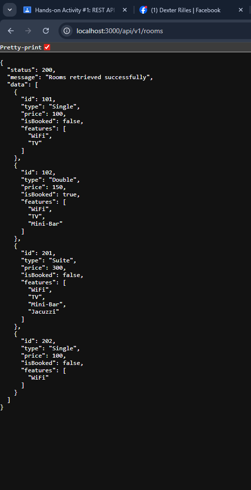

# RESTful API Activity - Dexter Rilles

## Best Practices Implementation

### **1. Environment Variables**
**Question:** Why use `.env` instead of putting settings in the code?

**Answer:**
- Easy to change settings without touching code
- Keeps secret info safe
- Different settings for testing vs real use
- Professional way to build apps

### **2. Resource Naming**
**Question:** Why use `/rooms` instead of `/room`?

**Answer:**
- `/rooms` = list of all rooms
- `/rooms/101` = one specific room
- Makes the API easy to understand
- This is how real APIs work

### **3. Status Codes**
**Question:** When use `201` vs `200`?

**Answer:**
- `200 OK` - When getting or updating data
- `201 Created` - When making something new

**Question:** Why send `404` instead of empty data?

**Answer:**
- `404` = The room doesn't exist
- Empty array = No rooms match your search
- They are different problems
- Makes it clear what went wrong

### **4. Error Handling**
- `400 Bad Request` - You didn't send the right info
- `404 Not Found` - That room doesn't exist
- Always send error message in same format

## Testing Screenshots

### GET /api/v1/rooms

### Why did I choose to Embed the [Review/Tag/Log]?"
- Because they belong directly to the item
- They are small, dependent pieces of data that are always shown with the parent
- Embedding makes reads faster and keeps everything together.

### Why did I choose to Reference the [Chef/User/Guest]?
- Because they exist independently and may connect to many items
- Referencing avoids duplication and allows updates in one place
- It keeps documents lighter and supports reuse across the system# rilles-api-activity

## Securing API

### 1. Authentication vs Authorization

**What is the difference between Authentication and Authorization in our code?**

**Answer:**

Authentication checks **who the user is**. In our system, the user logs in using their email and password. If the login is correct, the system creates a **JWT token**.

Authorization checks **what the user is allowed to do**. In our code, the `authorize` middleware checks the user's role (admin, manager, or user) and decides if they can access certain routes like creating or deleting rooms.

---

### 2. Security (bcrypt)

**Why did we use bcryptjs instead of saving passwords as plain text in MongoDB?**

**Answer:**

We use **bcryptjs** to hash the password before saving it in the database. This makes the password secure. If someone accesses the database, they will not see the real password because it is encrypted. During login, bcrypt compares the entered password with the hashed password to check if it matches.

---

### 3. JWT Structure

**What does the protect middleware do when it receives a JWT from the client?**

**Answer:**

The `protect` middleware checks if the request has a **JWT token** in the Authorization header. If the token is valid, it decodes the token, finds the user in the database, and attaches the user information to `req.user`. This allows the system to know which user is making the request and check if they are allowed to access protected routes.

